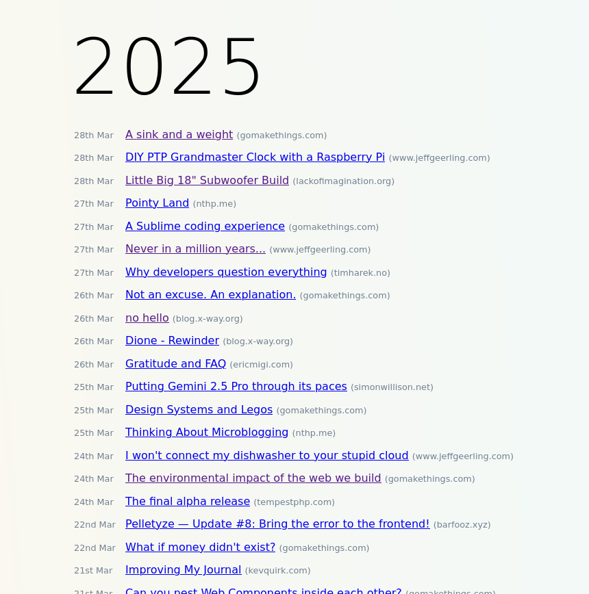

# Feed Forager

Your own stupid simple personal RSS feed aggregator.




## Run

Create a file called `feeds.txt` in the root of the project and add URLs of the RSS/Atom feeds, one-per-line.

```txt
https://example.org/feed.rss
```

The easiest way to get started is to run PHPs built-in webserver.

```
PHP_CLI_SERVER_WORKERS=$(nproc) php -S localhost:8009 -t public
```

There is also a Docker container:

```
docker build -t feed-forager .
docker run \
    --name feed-forager \
    -e PHP_CLI_SERVER_WORKERS=$(nproc) \
    -d \
    -p 8009:80 \
    -v $PWD/feeds.txt:/var/www/html/feeds.txt \
    feed-forager
```
